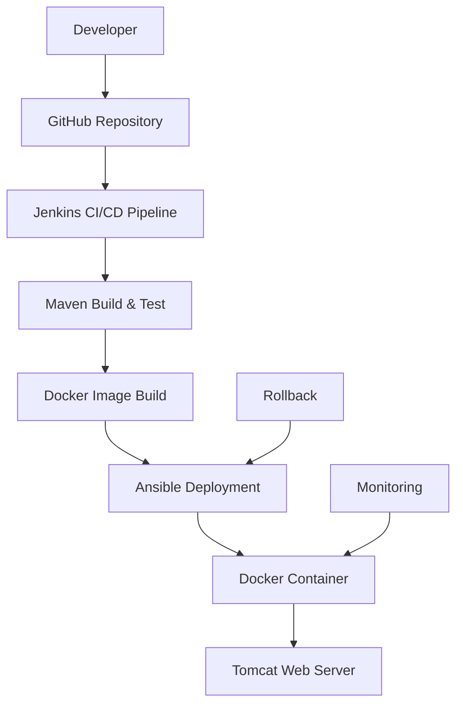

# Enterprise DevOps CI/CD Pipeline - Jenkins, Maven, GitHub, Ansible & Docker

<<<<<<< HEAD
[](https://github.com/iam-aniketmore/DevOpsProject1)
[](https://www.oracle.com/java/)
[](https://maven.apache.org/)
[](https://www.docker.com/)
[](https://www.jenkins.io/)

A comprehensive DevOps project demonstrating enterprise-grade CI/CD pipeline implementation using Jenkins, Maven, GitHub, Ansible, and Docker. This project showcases modern DevOps practices for automated building, testing, and deployment of Java web applications.

## 🏗️ Architecture Overview



### Key Components

- **Source Control**: GitHub repository for version control and collaboration
- **CI/CD Orchestration**: Jenkins for automated pipeline execution
- **Build Tool**: Maven for dependency management and build automation
- **Infrastructure as Code**: Ansible for configuration management and deployment
- **Containerization**: Docker for application packaging and deployment
- **Application Server**: Apache Tomcat 9 for Java web application hosting

## 🚀 Quick Start

### Prerequisites

- AWS account with EC2 access
- GitHub account
- Basic knowledge of Linux, Docker, and DevOps concepts
- SSH client (PuTTY/Kitty for Windows users)

### Infrastructure Requirements

| Component | Instance Type | OS | Purpose |
|-----------|---------------|----|---------|
| Jenkins Server | t3.small | Amazon Linux 2023 | CI/CD Pipeline Orchestration |
| Ansible Control Node | t2.micro | Amazon Linux 2023 | Configuration Management |
| Docker Host | t2.micro | Amazon Linux 2023 | Application Deployment |
| Developer Environment | t2.micro | Amazon Linux 2023 | Code Development |

## 📋 Installation & Setup

### Step 1: Launch Developer Environment

1. **Launch EC2 Instance**
   - AMI: Amazon Linux 2023
   - Instance Type: t2.micro
   - Configure security groups for SSH access

2. **Configure Developer Environment**
   ```bash
   # Set hostname and timezone
   sudo hostnamectl set-hostname dev1
   sudo timedatectl set-timezone Asia/Kolkata
   
   # Install Git
   yum install git -y
   
   # Create project directory
   mkdir /devpro1 && cd /devpro1
   git init
   
   # Configure Git
   git config --global user.name "your-username"
   git config --global user.email "your-email@example.com"
   ```

### Step 2: Setup GitHub Repository

1. Create a new repository on GitHub named "DevOpsProject1"
2. Connect local repository to GitHub:
   ```bash
   git remote add origin https://github.com/your-username/DevOpsProject1.git
   git branch -M main
   git push -u origin main
   ```

### Step 3: Configure Jenkins Server

1. **Launch Jenkins Server**
   - AMI: Amazon Linux 2023
   - Instance Type: t3.small (recommended for production)

2. **Install Java and Tomcat**
   ```bash
   # Update system
   yum update -y
   
   # Install Java
   yum install java-11* -y
   
   # Create Tomcat user
   groupadd --system tomcat
   useradd -d /usr/share/tomcat -r -s /bin/false -g tomcat tomcat
   
   # Download and install Tomcat
   wget https://archive.apache.org/dist/tomcat/tomcat-9/v9.0.63/bin/apache-tomcat-9.0.63.tar.gz
   tar -xvzf apache-tomcat-9.0.63.tar.gz -C /usr/share/
   ln -s /usr/share/apache-tomcat-9.0.63/ /usr/share/tomcat
   chown -R tomcat:tomcat /usr/share/tomcat
   ```

3. **Configure Tomcat Service**
   ```bash
   # Create systemd service
   cat > /etc/systemd/system/tomcat.service << 'EOF'
   [Unit]
   Description=Tomcat Server
   After=syslog.target network.target
   
   [Service]
   Type=forking
   User=tomcat
   Group=tomcat
   Environment=JAVA_HOME=/usr/lib/jvm/jre
   Environment='JAVA_OPTS=-Djava.awt.headless=true'
   Environment=CATALINA_HOME=/usr/share/tomcat
   Environment=CATALINA_BASE=/usr/share/tomcat
   Environment=CATALINA_PID=/usr/share/tomcat/temp/tomcat.pid
   Environment='CATALINA_OPTS=-Xms512M -Xmx1024M'
   
   ExecStart=/usr/share/tomcat/bin/catalina.sh start
   ExecStop=/usr/share/tomcat/bin/catalina.sh stop
   
   [Install]
   WantedBy=multi-user.target
   EOF
   
   # Enable and start Tomcat
   systemctl daemon-reload
   systemctl start tomcat
   systemctl enable tomcat
   ```

4. **Install Jenkins**
   ```bash
   cd /usr/share/tomcat/webapps
   wget https://updates.jenkins.io/download/war/2.462/jenkins.war
   systemctl restart tomcat
   ```

5. **Configure Jenkins**
   - Access Jenkins at `http://your-jenkins-ip/jenkins`
   - Get initial admin password: `cat /usr/share/tomcat/.jenkins/secrets/initialAdminPassword`
   - Complete setup with admin credentials
   - Install suggested plugins

### Step 4: Install and Configure Tools

1. **Configure Java Environment**
   ```bash
   echo 'JAVA_HOME=/usr/lib/jvm/java-17-amazon-corretto.x86_64/bin/java' >> ~/.bash_profile
   echo 'PATH=$PATH:$JAVA_HOME:$HOME/bin' >> ~/.bash_profile
   source ~/.bash_profile
   ```

2. **Install Maven**
   ```bash
   cd /opt/
   wget https://dlcdn.apache.org/maven/maven-3/3.8.8/binaries/apache-maven-3.8.8-bin.tar.gz
   tar -xvzf apache-maven-3.8.8-bin.tar.gz
   echo 'MAVEN_HOME=/opt/apache-maven-3.8.8' >> ~/.bash_profile
   echo 'M2=/opt/apache-maven-3.8.8/bin/' >> ~/.bash_profile
   echo 'PATH=$PATH:$MAVEN_HOME:$M2:$HOME/bin' >> ~/.bash_profile
   source ~/.bash_profile
   ```

3. **Install Git**
   ```bash
   yum install git -y
   ```

### Step 5: Configure Jenkins Pipeline

1. **Setup Tools in Jenkins**
   - Go to Manage Jenkins → Tools
   - Configure Git path: `/bin/git`
   - Add Maven installation with path: `/opt/apache-maven-3.8.8/`

2. **Create Jenkins Job**
   - New Item → Freestyle project
   - Name: `devpro2025`
   - Source Code Management: Git
     - Repository URL: `https://github.com/your-username/DevOpsProject1.git`
     - Branch: `main`
   - Build Steps: Invoke top-level Maven targets
     - Maven Version: `mvn`
     - Goals: `clean install package`

### Step 6: Setup Ansible Control Node

1. **Launch Ansible Server**
   - Use bootstrap script for automated setup:
   ```bash
   #!/bin/bash
   yum update -y
   yum install ansible* -y
   hostnamectl set-hostname ansible
   useradd itadmin
   echo 111 | passwd --stdin itadmin
   echo 111 | passwd --stdin root
   echo "itadmin ALL=(ALL) NOPASSWD: ALL" >> /etc/sudoers
   sed 's/PasswordAuthentication no/PasswordAuthentication yes/' -i /etc/ssh/sshd_config
   echo PermitRootLogin yes >> /etc/ssh/sshd_config
   systemctl restart sshd
   ```

2. **Configure SSH Authentication**
   ```bash
   su itadmin
   ssh-keygen
   ssh-copy-id itadmin@docker-node1
   ```

3. **Create Ansible Configuration**
   ```bash
   mkdir /opt/project
   cat > /opt/project/inventory << 'EOF'
   [docker]
   docker-node1
   EOF
   
   cat > /opt/project/ansible.cfg << 'EOF'
   [defaults]
   inventory=/opt/project/inventory
   remote_user=itadmin
   host_key_checking=false
   
   [privilege_escalation]
   become=true
   become_user=root
   become_method=sudo
   become_ask_pass=false
   EOF
   ```

### Step 7: Setup Docker Host

1. **Launch Docker Server**
   - Use bootstrap script:
   ```bash
   #!/bin/bash
   yum update -y
   hostnamectl set-hostname docker-node1
   useradd itadmin
   echo 111 | passwd --stdin itadmin
   echo 111 | passwd --stdin root
   echo "itadmin ALL=(ALL) NOPASSWD: ALL" >> /etc/sudoers
   sed 's/PasswordAuthentication no/PasswordAuthentication yes/' -i /etc/ssh/sshd_config
   echo PermitRootLogin yes >> /etc/ssh/sshd_config
   systemctl restart sshd
   ```

2. **Install Docker**
   ```bash
   yum install docker -y
   systemctl start docker
   systemctl enable docker
   usermod -aG docker itadmin
   ```

### Step 8: Create Ansible Playbook

Create `/opt/project/create-docker-container.yml`:
```yaml
---
- name: create docker container
  hosts: all
  ignore_errors: yes
  tasks:
    - name: install docker
      yum:
        name: docker
        state: present
    
    - name: start and enable docker
      service:
        name: docker
        state: started
        enabled: yes
    
    - name: add user into group
      command: usermod -aG docker itadmin
    
    - name: create docker directory
      file:
        path: /opt/docker
        state: directory
    
    - name: change ownership
      command: chown -R itadmin:itadmin /opt/docker
    
    - name: stop the running container
      shell: docker stop webapp
    
    - name: remove container
      shell: docker rm -f webapp
    
    - name: remove container image
      shell: docker rmi -f myapp:latest
    
    - name: transfer docker file
      copy:
        src: /opt/docker/Dockerfile
        dest: /opt/docker/
    
    - name: transfer web application
      copy:
        src: /opt/docker/webapp.war
        dest: /opt/docker/
    
    - name: build docker image
      shell: cd /opt/docker; docker build -t myapp .
    
    - name: create docker tomcat container
      shell: docker run -dt --name webapp -p 80:8080 myapp:latest
```

### Step 9: Configure Jenkins Deployment

1. **Install Publish Over SSH Plugin**
   - Manage Jenkins → Manage Plugins → Available
   - Install "Publish Over SSH"

2. **Configure SSH Credentials**
   - Manage Jenkins → Configure System
   - SSH Servers → Add
   - Name: `Ansible_Server`
   - Hostname: `ansible-server-ip`
   - Username: `itadmin`
   - Password: `111`

3. **Update Jenkins Job**
   - Post-build Actions → Send build artifacts over SSH
   - Source files: `webapp/target/*.war`
   - Remove prefix: `webapp/target/`
   - Remote directory: `//opt/docker`
   - Exec command: `cd /opt/project; ansible-playbook create-docker-container.yml`

## 🏗️ Project Structure

```
DevOpsProject1/
├── pom.xml                    # Maven build configuration
├── Dockerfile                 # Docker container definition
├── src/
│   └── main/
│       └── webapp/           # Java web application
│           ├── index.jsp     # Main application page
│           └── WEB-INF/
│               └── web.xml   # Web application configuration
└── README.md                 # This documentation
```

## 🔧 Configuration Files

### pom.xml
Maven project configuration with Java 11 compatibility and WAR packaging.

### Dockerfile
Multi-stage Docker build using Tomcat 9 base image with automatic webapp deployment.

### Jenkins Pipeline
Automated CI/CD pipeline with:
- Source code checkout from GitHub
- Maven build and test execution
- Docker image creation
- Ansible-based deployment

## 🚀 Deployment Process

1. **Code Commit**: Developer pushes code to GitHub
2. **Jenkins Trigger**: Pipeline automatically triggers on code push
3. **Build Phase**: Maven compiles and packages the application
4. **Test Phase**: Automated testing (can be extended)
5. **Package Phase**: WAR file creation
6. **Deploy Phase**: Ansible deploys to Docker containers
7. **Verification**: Application available on configured port

## 📊 Monitoring & Maintenance

### Health Checks
- Jenkins job status monitoring
- Docker container health checks
- Application availability testing

### Logs and Debugging
```bash
# Jenkins logs
tail -f /usr/share/tomcat/.jenkins/logs/

# Docker container logs
docker logs webapp

# Ansible playbook execution
ansible-playbook -v create-docker-container.yml
```

### Rollback Strategy
1. Stop current container: `docker stop webapp`
2. Remove container: `docker rm webapp`
3. Revert to previous image tag
4. Restart deployment

## 🔒 Security Considerations

### Production Hardening
- Use SSH key authentication instead of passwords
- Implement proper firewall rules
- Use environment-specific configurations
- Regular security updates and patches

### Best Practices
- Never commit sensitive data to repository
- Use Jenkins credentials store for secrets
- Implement proper access controls
- Regular security audits

## 🛠️ Troubleshooting

### Common Issues

1. **Jenkins Build Failures**
   - Check Maven configuration
   - Verify Java version compatibility
   - Review build logs for specific errors

2. **Docker Deployment Issues**
   - Verify Docker daemon is running
   - Check container logs for application errors
   - Ensure proper port mappings

3. **Ansible Connection Problems**
   - Verify SSH key authentication
   - Check inventory file configuration
   - Ensure proper user permissions

### Support

For issues and questions:
1. Check the troubleshooting section above
2. Review Jenkins build logs
3. Check Docker container status
4. Verify Ansible playbook execution

## 📈 Performance Optimization

### Jenkins Optimization
- Use appropriate instance sizes
- Implement parallel builds where possible
- Configure proper resource limits
- Use build caching strategies

### Docker Optimization
- Use multi-stage builds
- Minimize image size
- Implement proper resource limits
- Use health checks

## 🤝 Contributing

1. Fork the repository
2. Create a feature branch
3. Make your changes
4. Test thoroughly
5. Submit a pull request

## 📄 License

This project is licensed under the MIT License - see the LICENSE file for details.

## 🙏 Acknowledgments

- Jenkins Community for CI/CD best practices
- Docker Community for containerization guidance
- Ansible Community for configuration management
- Maven Community for build automation

---

**Note**: This is a production-grade example. Always review and adapt configurations for your specific environment and security requirements.

For more information, visit:
- [Jenkins Documentation](https://www.jenkins.io/doc/)
- [Docker Documentation](https://docs.docker.com/)
- [Ansible Documentation](https://docs.ansible.com/)
- [Maven Documentation](https://maven.apache.org/guides/)